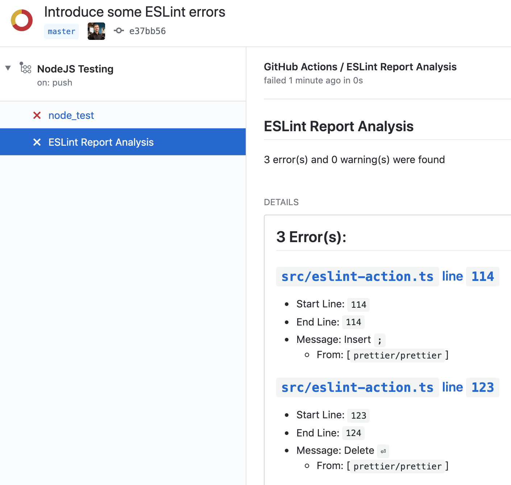

# ESLint Annotate from Report JSON

## Description

Analyzes an ESLint a report JSON file and posts the results.

On `pull_request` annotates the pull request diff with warnings and errors


On `push` creates a `ESLint Report Analysis` with a summary of errors and warnings, including links to the line numbers of the violations.



## Why another ESLint action?

The others I tried to use ran ESLint in NodeJS themselves. With this action, I can take an ESLint report generated from the command line and process the results.

This allows for more flexibility on how ESLint is run. This action is agnostic enough to handle different configurations, extensions, etc. across projects without making assumptions on how ESLint should be run.

## Usage Example

In `.github/workflows/nodejs.yml`:

```yml
name: Example NodeJS Workflow

on: [pull_request]

jobs:
  node_test:
    runs-on: ubuntu-latest

    steps:
      - uses: actions/checkout@v1
      - uses: webfactory/ssh-agent@v0.1.1
        with:
          ssh-private-key: ${{ secrets.GITHUB_SSH_PRIVATE_KEY }}
      - name: Node.JS 10.x
        uses: actions/setup-node@v1
        with:
          node-version: "10.x"
      - name: Cache node modules
        uses: actions/cache@v1
        with:
          path: node_modules
          key: ${{ runner.OS }}-build-${{ hashFiles('**/package-lock.json') }}
          restore-keys: |
            ${{ runner.OS }}-build-${{ env.cache-name }}-
            ${{ runner.OS }}-build-
            ${{ runner.OS }}-
      - name: Install Node Dependencies
        run: npm install
        env:
          CI: TRUE
      - name: Test Code Linting
        run: npm run lint
      - name: Save Code Linting Report JSON
        # npm script for ESLint
        # eslint --output-file eslint_report.json --format json src
        # See https://eslint.org/docs/user-guide/command-line-interface#options
        run: npm run lint:report
        # Continue to the next step even if this fails
        continue-on-error: true
      - name: Annotate Code Linting Results
        uses: ataylorme/eslint-annotate-action@1.0.1
        with:
          repo-token: "${{ secrets.GITHUB_TOKEN }}"
          report-json: "eslint_report.json"
      - name: Upload ESLint report
        uses: actions/upload-artifact@v1
        with:
          name: eslint_report.json
          path: eslint_report.json